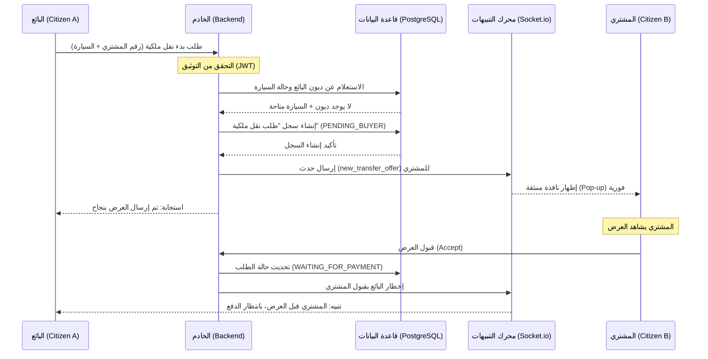

# 3.7 مخططات التسلسل (Sequence Diagrams)

يوضح مخطط التسلسل التفاعل الزمني بين الكائنات المختلفة في النظام لإنجاز عملية محددة. سنستعرض هنا **"التسلسل الزمني لبدء عملية نقل الملكية"**، والتي تبرز دور الـ WebSockets في الربط بين البائع والمشتري لحظياً.

## مخطط تسلسل بدء نقل الملكية

يوضح المخطط أدناه كيف يتدفق الطلب من البائع عبر الخادم وصولاً إلى المشتري في الوقت الحقيقي:

## تحليل التسلسل الزمني
1.  **التحقق الاستباقي:** يبدأ الخادم بالتحقق من قاعدة البيانات قبل اتخاذ أي خطوة خارجية، مما يضمن أمان العملية.
2.  **الاتصال ثنائي الاتجاه:** يوضح المخطط أن الخادم لا يكتفي بالرد على البائع، بل يقوم بدفع (Push) بيانات للمشتري عبر `Socket.io` بشكل مستقل.
3.  **تزامن الحالة:** يتم تحديث قاعدة البيانات في كل خطوة مفصلية لضمان أنه في حال انقطاع الاتصال، يمكن للنظام استعادة الحالة الأخيرة للمعاملة.

يعكس هذا المخطط الكفاءة العالية للنظام في تقليل زمن الانتظار، حيث يتم إنجاز "المصافحة" القانونية بين الطرفين في ثوانٍ معدودة وبشكل موثق تماماً.
